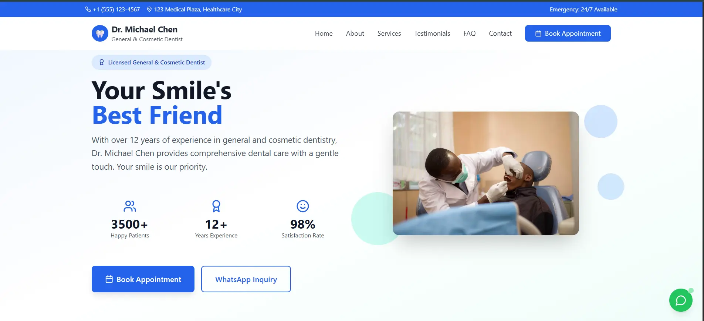

# Dental Clinic Website

A modern and responsive dental clinic website designed to showcase services,
doctor information, clinic achievements, and allow users to book appointments
online. The platform focuses on patient experience, clarity, and trust-building
design.

---

## 🦷 Features

- Online appointment booking (UI-based, backend-ready)
- Dental services showcase
- Doctor profile and clinic address section
- Clinic achievements and experience highlights
- Clean and professional healthcare UI
- Fully responsive design (mobile, tablet, desktop)
- Clear call-to-action for patient engagement

---

## 🛠 Tech Stack

- Frontend: React
- Styling: Tailwind CSS
- Build Tool: Vite
- Version Control: Git & GitHub

---

## 📸 Screenshots

### Homepage


### Services Section


### Appointment Booking


---
## Live site link: 
https://dental-clinic-website-murex-rho.vercel.app/


## ▶️ Run Locally

```bash
git clone https://github.com/ady254/dental-clinic-website.git
cd dental-clinic-website
npm install
npm run dev
